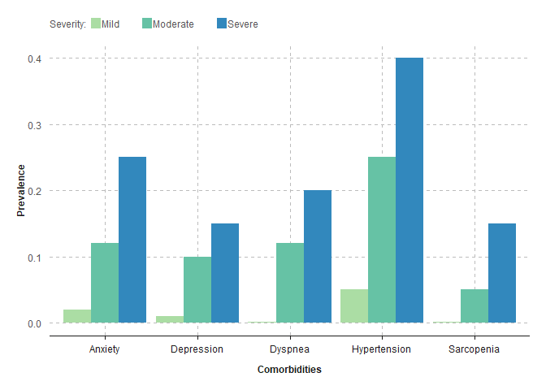
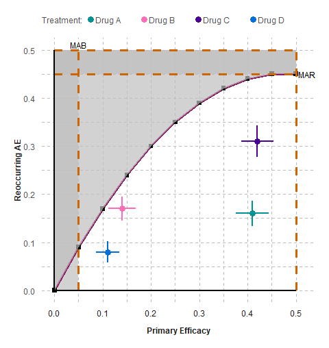
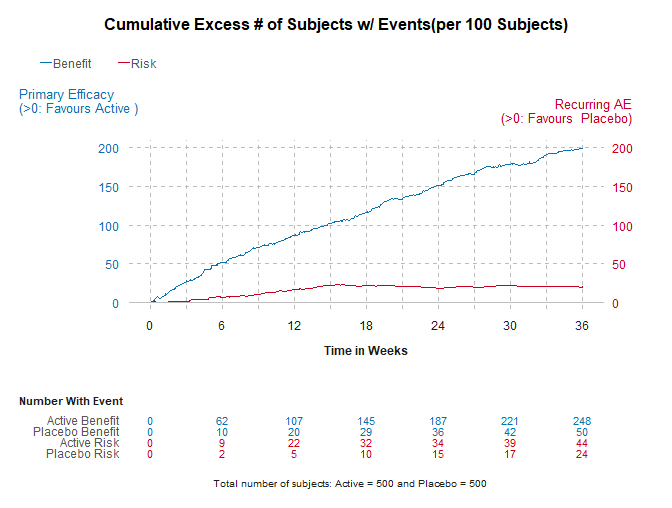

<!-- README.md is generated from README.Rmd. Please edit that file -->

# brcharts

<!-- badges: start -->


[](https://www.repostatus.org/#active)
[](https://tooomm.github.io/github-release-stats/?username=insightsengineering&repository=r.pkg.template)
[](https://github.com/BR-Visualization/brcharts/tree/main)
[](https://github.com/BR-Visualization/brcharts/issues?q=is%3Aissue+is%3Aopen+sort%3Aupdated-desc)
[](https://github.com/BR-Visualization/brcharts/actions/workflows/links.yaml)
[](https://github.com/BR-Visualization/brcharts/actions/workflows/test-coverage.yaml)
[](https://github.com/BR-Visualization/brcharts/actions/workflows/licenses.yaml)
[](https://github.com/BR-Visualization/brcharts/actions/workflows/pkgdown.yaml)
[](https://github.com/BR-Visualization/brcharts/actions/workflows/build-check-install.yaml)
[](https://github.com/BR-Visualization/brcharts/actions/workflows/release.yaml)
[](https://github.com/BR-Visualization/brcharts/actions/workflows/spelling.yaml)
[](https://github.com/BR-Visualization/brcharts/actions/workflows/style.yaml)
[](https://github.com/BR-Visualization/brcharts/actions/workflows/linter.yaml)
[](https://github.com/BR-Visualization/brcharts/actions/workflows/version-bump.yaml)
[](https://github.com/BR-Visualization/brcharts/actions/workflows/version.yaml)
<!-- badges: end -->

The goal of brcharts is to create benefit-risk charts in the
publication: Colopy MW, Gakava L, Chen C. Planning Benefit-Risk
Assessments Using Visualizations. Ther Innov Regul Sci. 2023
Nov;57(6):1123-1135. doi: 10.1007/s43441-023-00563-9. Epub 2023 Sep 8.
PMID: 37682462.

## Installation

You can install the development version of brcharts from
[GitHub](https://github.com/) with:

``` r
# install.packages("devtools")
devtools::install_github("BR-Visualization/brcharts")
```

## Figure 2 - Demographics (Pyramid Chart)


## Figure 4 - Comorbidities (Grouped Bar Chart)



## Figure 7 - Trade-off Plot



## Figure 12 - Composite Outcome (Stacked Bar Chart)


## Figure 13 - Cumulative Excess Plot


