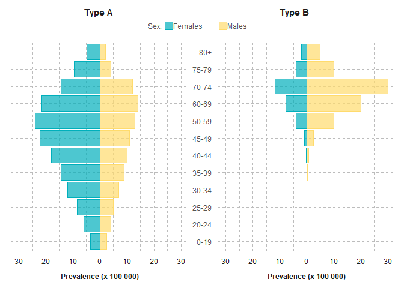

<!-- README.md is generated from README.Rmd. Please edit that file -->

# brcharts

<!-- badges: start -->
<!-- badges: end -->

The goal of brcharts is to create benefit-risk charts in the
publication: Colopy MW, Gakava L, Chen C. Planning Benefit-Risk
Assessments Using Visualizations. Ther Innov Regul Sci. 2023
Nov;57(6):1123-1135. doi: 10.1007/s43441-023-00563-9. Epub 2023 Sep 8.
PMID: 37682462.

## Installation

You can install the development version of brcharts from
[GitHub](https://github.com/) with:

``` r
# install.packages("devtools")
devtools::install_github("BR-Visualization/brcharts")
```

## Figure 2 - Demographics (Pyramid Chart)



## Figure 4 - Comorbidities (Grouped Bar Chart)


